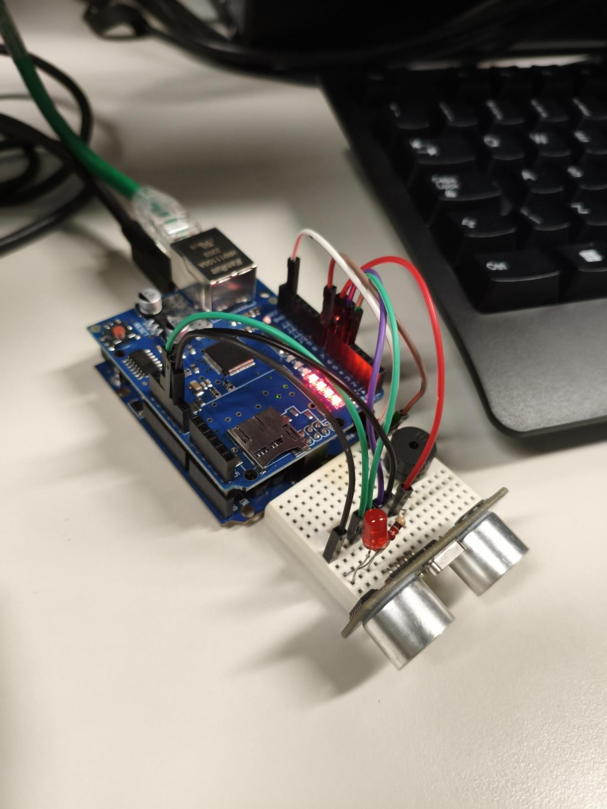
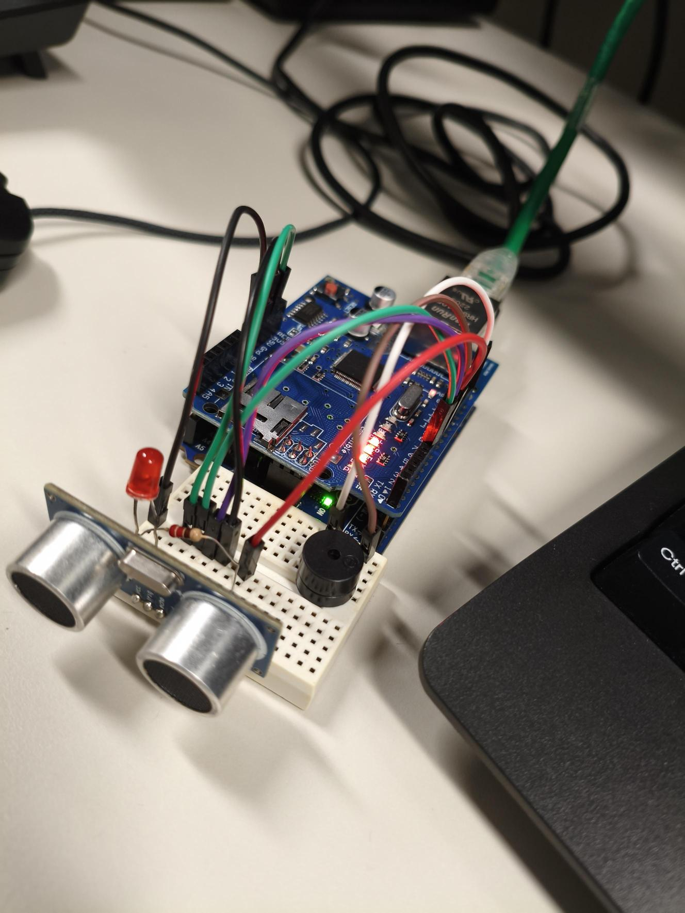
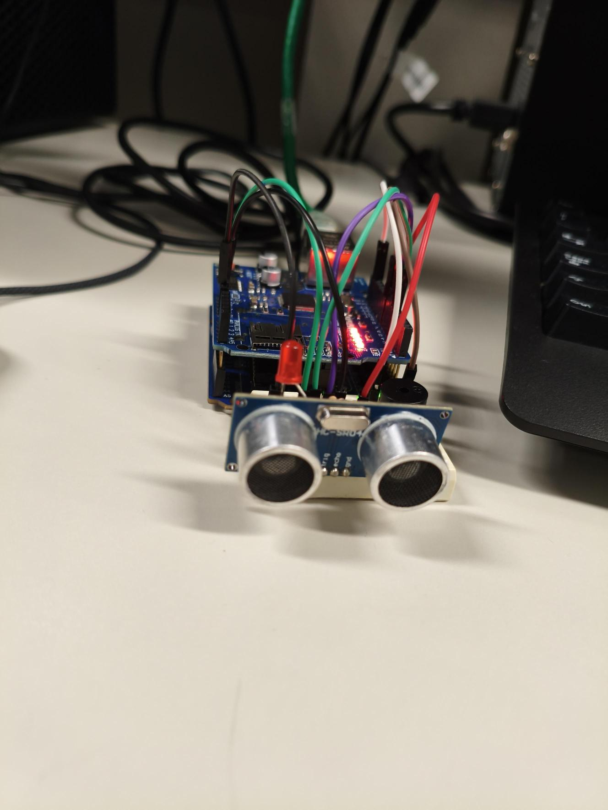
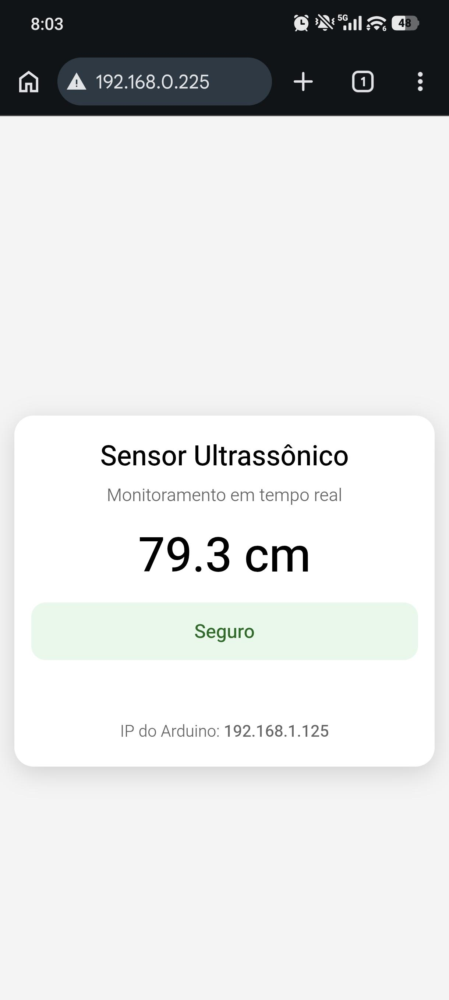

# Monitoramento de Distância com Arduino e Interface Web

Aluno: Rafael Souza e Levy

Professor: José de Assis

Data: 27/03/2026

---

## 1. Objetivo

Desenvolver um sistema de monitoramento de distância em tempo real utilizando um sensor ultrassônico conectado a um Arduino com Ethernet Shield.

O sistema permite:

* Medir a distância de objetos em centímetros
* Exibir os dados em tempo real via navegador web
* Emitir alertas visuais e sonoros quando a distância estiver abaixo de um limite definido

Além disso, o projeto demonstra a integração entre hardware embarcado e uma interface web acessível por dispositivos na mesma rede local.

---

## 2. Equipamentos utilizados neste laboratório:

* Arduino Uno
* Ethernet Shield
* Sensor Ultrassônico HC-SR04
* LED
* Resistor 220Ω
* Buzzer
* Cabos Jumpers
* Cabo Ethernet
* Computador para programação
* Smartphone

---

## 3. Topologia da Rede

A rede utilizada neste projeto é uma rede local (LAN), onde todos os dispositivos estão conectados ao mesmo roteador.

### Estrutura:

* O Arduino com Ethernet Shield é conectado ao roteador via cabo Ethernet
* O computador e o celular se conectam ao mesmo roteador (via Wi-Fi ou cabo)
* O Arduino atua como um servidor web, disponibilizando:

  * Interface web (HTML)
  * Dados do sensor em tempo real (JSON)

### Funcionamento:

* O usuário acessa o IP do Arduino pelo navegador
* O Arduino responde com a interface web
* A interface realiza requisições periódicas ao Arduino para atualizar os dados

---

## 4. Plano de endereçamento IP

Foi utilizado um endereço IP fixo para o Arduino dentro da rede local.

### Configuração:

* IP do Arduino: `192.168.0.225`
* Máscara de rede: `255.255.255.0`
* Gateway: roteador local

### Observações:

* Todos os dispositivos (PC e celular) devem estar na mesma rede

---

## 6. Imagens da execução no laboratório

---
## 7. Conclusão

O projeto demonstrou com sucesso a integração entre um sistema embarcado (Arduino) e uma interface web acessível em tempo real.

Foi possível:

* Realizar medições precisas de distância utilizando o sensor ultrassônico
* Implementar um servidor web diretamente no Arduino
* Desenvolver uma interface responsiva acessível por computador e celular
* Criar um sistema de alerta baseado em condições de distância

Além disso, o projeto evidenciou conceitos importantes como:

* Comunicação em rede local
* Endereçamento IP
* Arquitetura cliente-servidor
* Integração entre hardware e software

Este tipo de solução pode ser expandido para aplicações de Internet das Coisas (IoT), como automação residencial, sistemas de segurança e monitoramento remoto.

---
